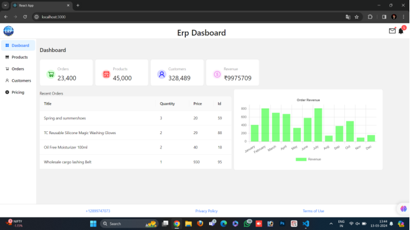
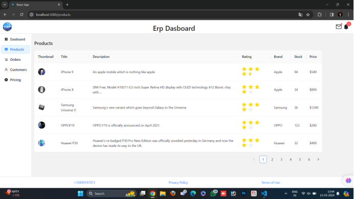
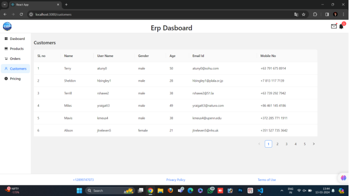
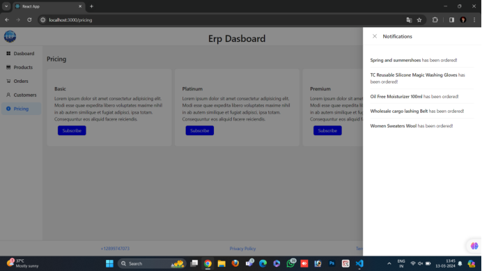
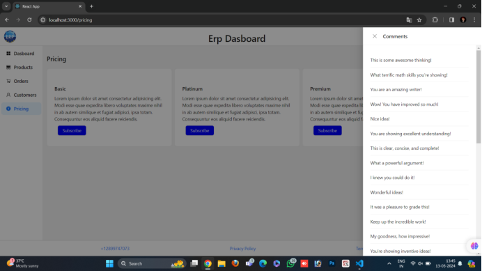

### ERP React App
### Overview
The ERP React App is a web application built using React for efficient enterprise resource planning. It allows businesses to manage various aspects of their resources, including Orders, customers, and products, in a centralized and user-friendly interface.
### Features
`Dashboard:` Track and manage revenue, no of orders, and no of customers .

`Products:` Efficiently manage product information , stock , rating and brand.

`Orders :` Track the orders by the id and name of the order and quantity of the product is sales.

`Customers:` In this we need to find the what kind of customers is need the what kind of products.

`Notification: ` It was drawer and view the no. Of orders have been ordered and ordered item list

`Comments: ` The comment drawer is used to draw the list of comments given by the customers

`Responsive Design: ` A user-friendly interface for website.
### Technologies Used
`React:` Front-end development library for building user interfaces.
`React Router:` For managing navigation within the application.
`Anti-Design-UI:` React components for implementing  Design.
### Installation
1.Clone the repository:
 by using the below code in bash
 git clone https://github.com/your-username/erp-system.git
2.Navigate to the project directory:
  using the below code in bash
  cd erp-system
3.Install dependencies:
  install all dependencies is reuired by using the code in bash
  npm install dependency name
4.Start the development server:
  run the react project by using the below code
  npm start
 running the above command it will automaticaly open your browser and navigate to http://localhost:3000 to view the application.
Contributing
Contributions are welcome! If you find any bugs or have suggestions for improvements, please open an issue or submit a pull request. 
